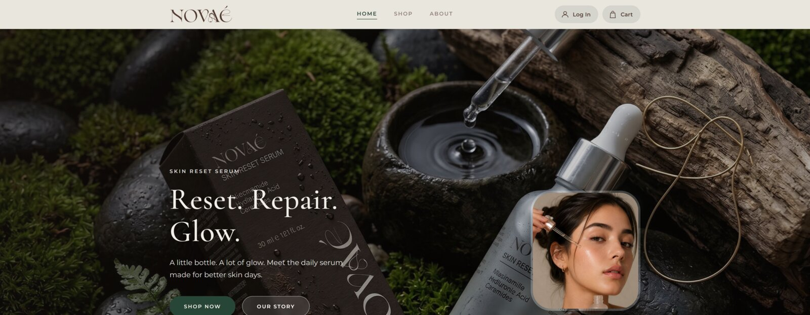
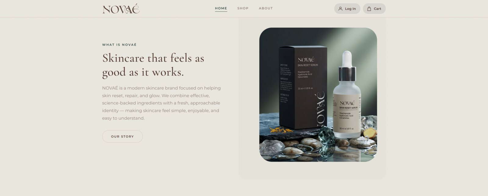
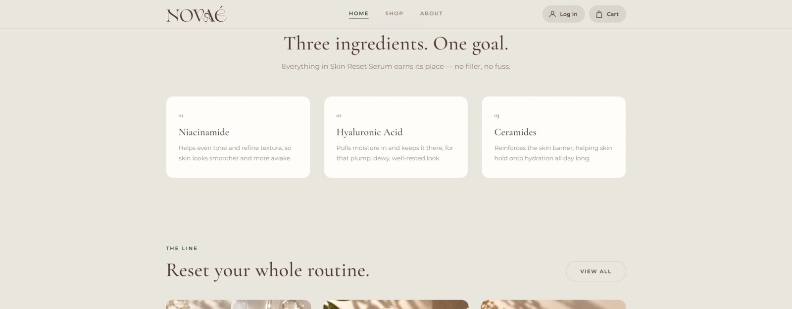
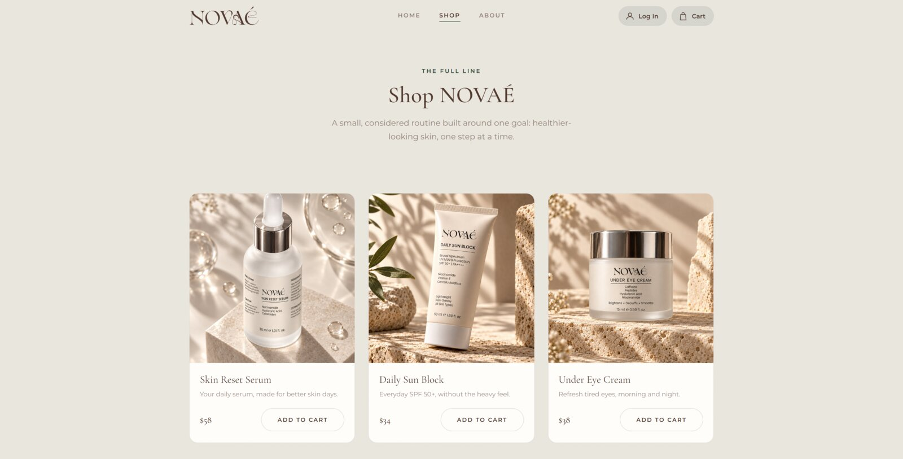
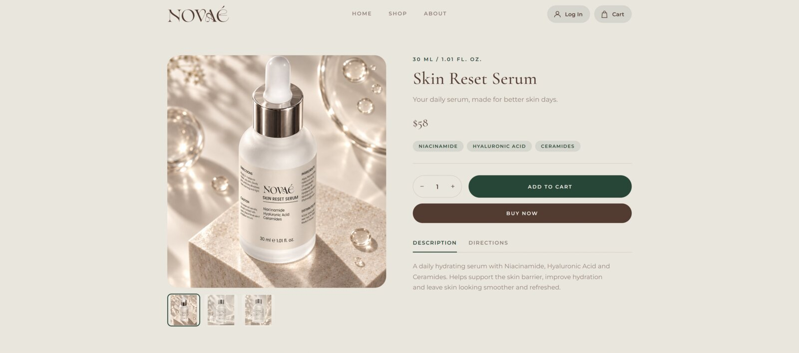
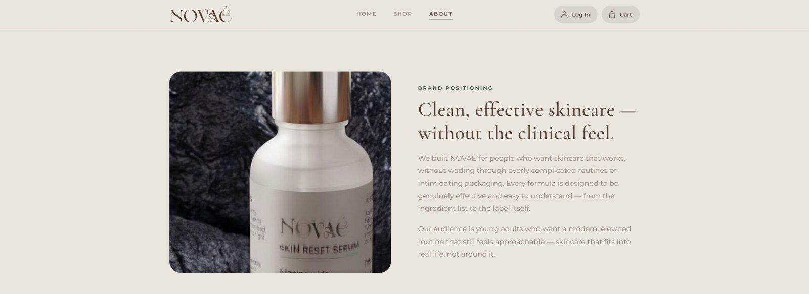
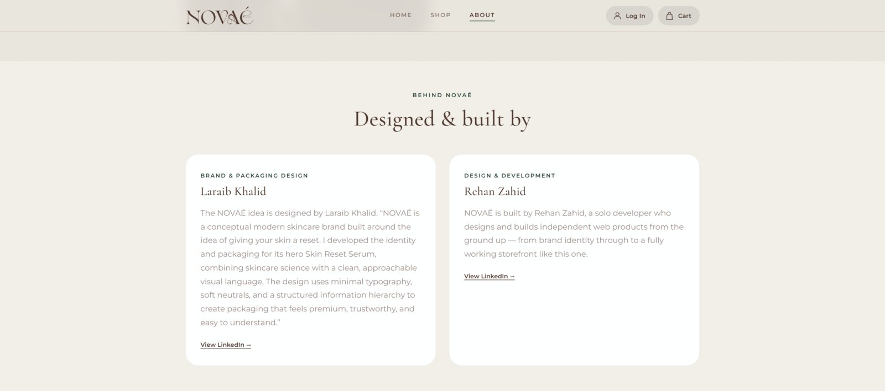
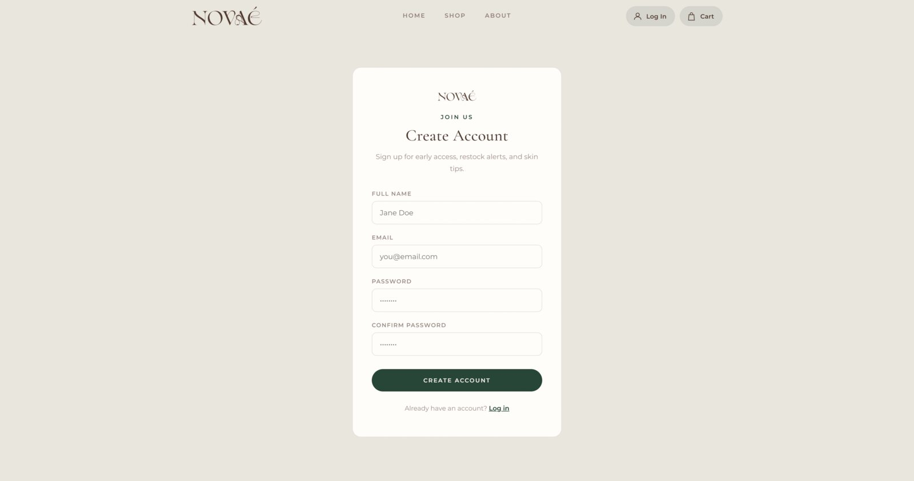
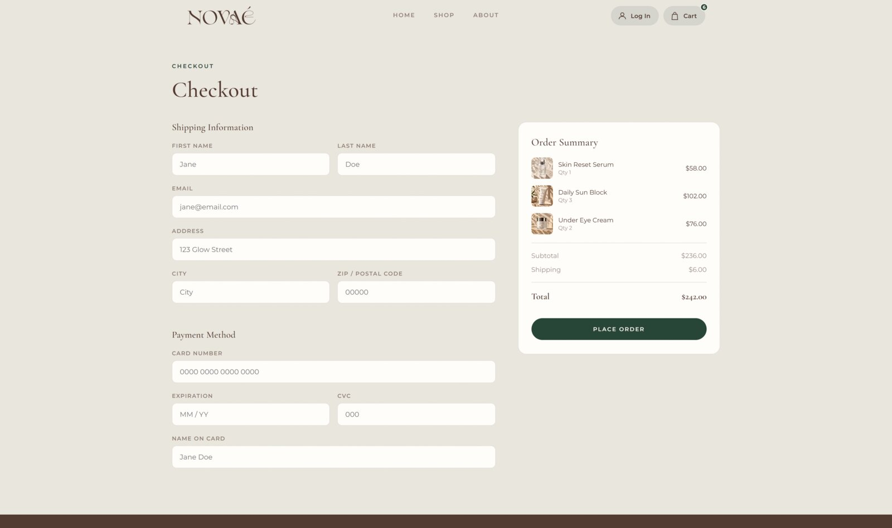

<p align="center">
  
</p>

<h3 align="center">Reset. Repair. Glow.</h3>

<p align="center">
  A conceptual, frontend-only marketing and e-commerce site for NOVAÉ, a modern skincare brand.
  <br>
  <a href="https://rehankhanzahid789.github.io/novae/"><strong>Live demo →</strong></a>
</p>

---

## About the project

NOVAÉ is a portfolio project: a full skincare brand and storefront, designed and built from
scratch. It is frontend-only — there is no backend or database — but every page, from the
homepage down to the checkout flow, is fully built out and interactive.

The full brand story, positioning, and the people behind the project are documented on the
site's own About page: **[rehankhanzahid789.github.io/novae/#/about](https://rehankhanzahid789.github.io/novae/#/about)**.

In short:

- **Brand:** NOVAÉ is a modern skincare brand built around one idea — giving skin (and a daily
  routine) a reset. Clean, effective skincare without the clinical feel.
- **Brand & packaging design:** [Laraib Khalid](https://www.linkedin.com/in/laraibkhalid-/)
- **Design & development:** [Rehan Zahid](https://www.linkedin.com/in/dev-rehan-zahid/)

Because there is no backend, actions that would normally need a server — logging in, signing up,
and placing an order — intentionally end in a brand-styled "Sorry, website down for maintenance"
message. Everything up to that point (browsing, product pages, cart, form validation) is fully
functional.

## Features

- Fully responsive marketing homepage, shop, and product detail pages
- Working cart with quantity controls, persisted to `localStorage`
- Product catalog with multiple images, ingredients, descriptions, and directions per product
- Checkout, login, and sign-up flows with real form fields and validation
- Custom 404 page
- Hash-based routing so the whole site works on GitHub Pages with no server configuration

## Tech stack

- [React](https://react.dev/)
- [Vite](https://vitejs.dev/)
- [react-router-dom](https://reactrouter.com/) (`HashRouter`)
- React Context + `localStorage` for cart state
- Plain CSS, no UI framework

## Screenshots

**Home**

<p>
  
</p>

The hero introduces the brand and its hero product, the Skin Reset Serum, straight away.

<p>
  
</p>

A short brand introduction sits alongside the hero product, so a first-time visitor understands
what NOVAÉ is within seconds of landing.

<p>
  
</p>

Key ingredients are called out before the full line is shown, reinforcing the "science-backed"
part of the brand.

<p>
  
</p>

A lifestyle shot and testimonial ground the product in a real routine rather than just studio shots.

**Shop**

<p>
  
</p>

The shop page lists the full three-product line with pricing and quick add-to-cart.

**Product detail**

<p>
  
</p>

Each product page includes a gallery, ingredients, quantity selector, and both "Add to Cart" and
"Buy Now" actions.

**About**

<p>
  
</p>

The About page carries the brand positioning and story in full.

<p>
  
</p>

It closes with credits for the two people behind the brand and the build.

**Sign up**

<p>
  
</p>

A complete sign-up form, styled to match the rest of the site.

**Checkout**

<p>
  
</p>

Checkout includes shipping information, payment fields, and a live order summary.

## Getting started

```bash
npm install
npm run dev
```

## Build

```bash
npm run build
npm run preview
```

## Deploy to GitHub Pages

1. Update the `homepage` field in `package.json` to match your GitHub username/repo, e.g.
   `"homepage": "https://yourusername.github.io/novae"`.
2. Push this project to a GitHub repo named `novae` (or update the homepage URL to match your
   repo name).
3. Run:

```bash
npm run deploy
```

This builds the site and pushes the `dist` folder to a `gh-pages` branch. Then, in your repo
settings, set GitHub Pages to serve from the `gh-pages` branch.

The app uses `HashRouter`, so client-side routes (like `/#/shop`) work correctly on GitHub Pages
without any extra server configuration or 404 redirects.

## Project structure

```
docs/                        Logo and README screenshots
src/
  components/                Navbar, Footer, Hero, ProductCard, MaintenanceModal
  context/CartContext.jsx    Cart state (React Context + localStorage)
  data/products.js           Product catalog
  pages/                     One component per route
                              (Home, Shop, ProductDetail, Cart, Checkout,
                               Login, SignUp, About, NotFound)
  assets/                    Brand imagery
```

## Brand

- **Colors:** espresso `#523B31`, forest `#294637`, bone `#EAE6DE`
- **Fonts:** Cormorant Garamond (serif) + Montserrat (sans-serif), loaded via Google Fonts
